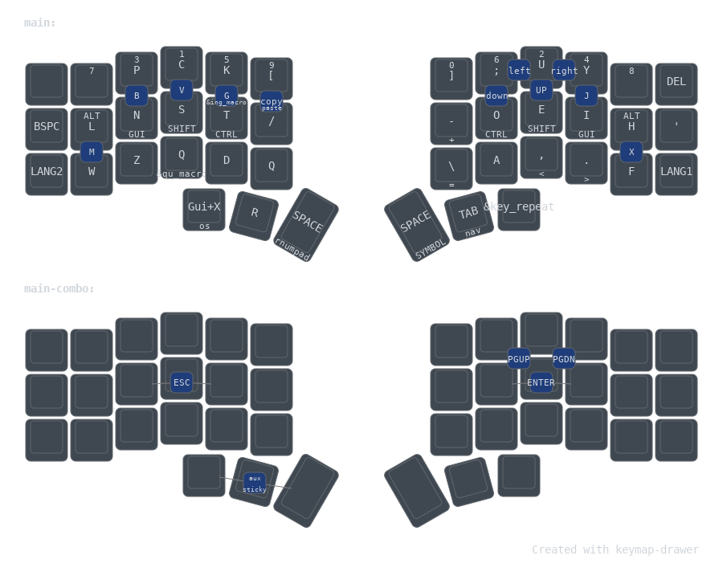
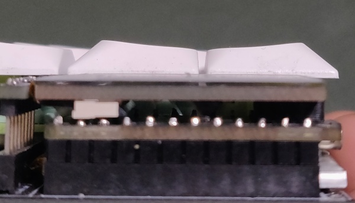

ZMK config for corne-ish 3x6 with epaper display and RGB. The key matrix is same as normal corne.

Utilize layout with many vertical combo to reduce stretching index finger to central column. 
In order to use such layout comfortably, you need keycaps that allow pressing two veritcal neigbor keys comfortably. I just rotated upper layer of JWA keycaps . It created a subtle concaved surface for fingers, where lowest point is between two rows. Moreover, the gap between rows is very narrow and it feels like one big key. It allows to use finger placment as on stenography keyboards, and pressing combo is very easy.

